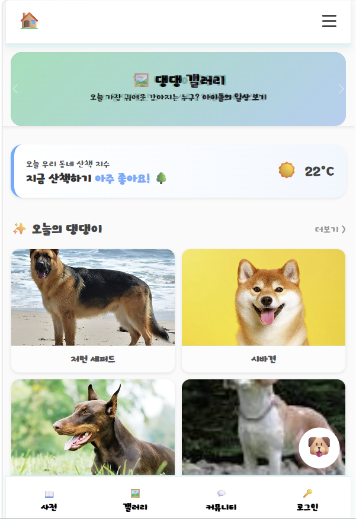
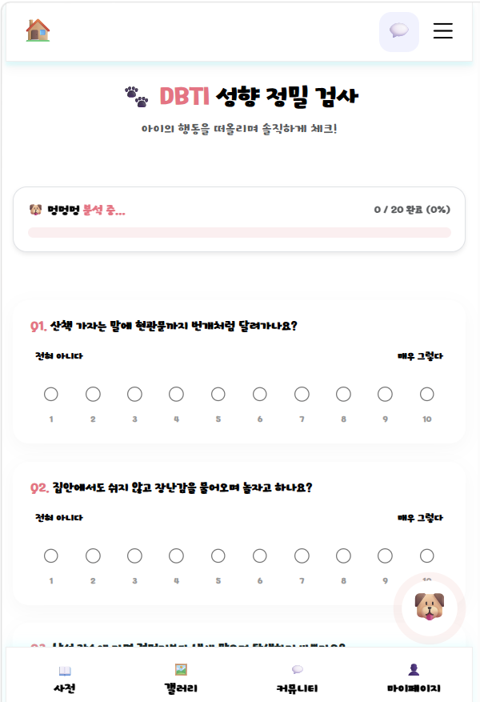
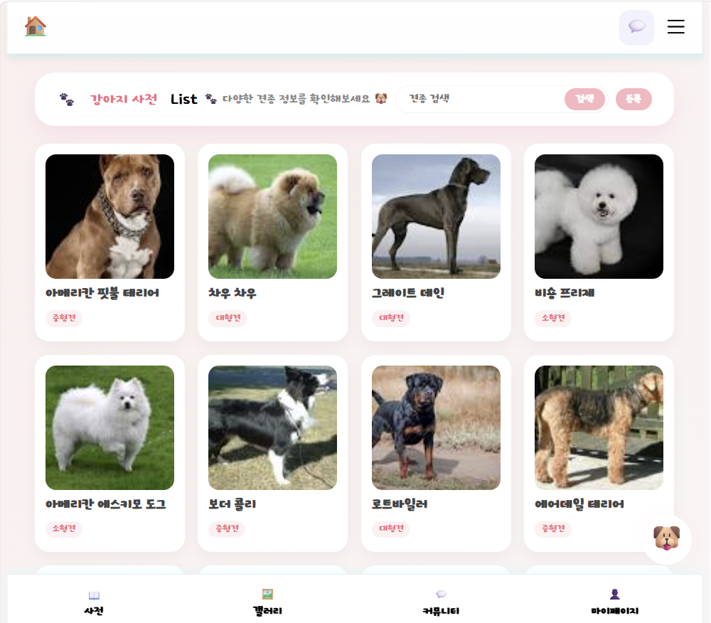
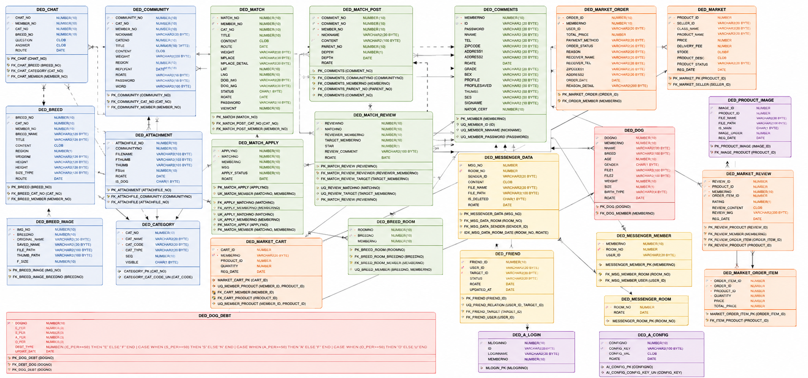
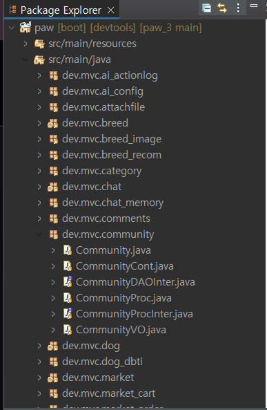

# 🐾 PAWS

## AI 기반 반려견 라이프 통합 플랫폼  
### AI-Powered Integrated Dog Life Platform

> PAWS는 AI와 데이터를 기반으로 반려인의 일상, 매칭, 커뮤니티, 거래를 하나의 플랫폼으로 연결하는 통합 반려견 라이프 플랫폼입니다.  
> PAWS is an AI-powered integrated dog lifestyle platform that connects daily pet life, matching, community, and commerce services into one ecosystem.

---

# 📚 목차 (Table of Contents)

- [📌 프로젝트 소개 (Project Overview)](#-프로젝트-소개-project-overview)
- [🚨 문제 정의 (Problem Definition)](#-문제-정의-problem-definition)
- [💡 해결 아이디어 (Solution)](#-해결-아이디어-solution)
- [🖼️ 서비스 미리보기 (Service Preview)](#️-서비스-미리보기-service-preview)
- [🖥️ 주요 기능 (Main Features)](#️-주요-기능-main-features)
- [🏡 라이프 메인 (Smart Lifestyle Main)](#-라이프-메인-smart-lifestyle-main)
- [🤖 AI 추천 시스템 (AI Recommendation System)](#-ai-추천-시스템-ai-recommendation-system)
- [🧠 DBTI 시스템 (DBTI System)](#-dbti-시스템-dbti-system)
- [💬 실시간 채팅 (Real-time Chat)](#-실시간-채팅-real-time-chat)
- [🛒 PAWS 마켓 (PAWS Market)](#-paws-마켓-paws-market)
- [🗂️ DB 설계 (Database Design)](#️-db-설계-database-design)
- [🏗️ 시스템 구조 (System Architecture)](#️-시스템-구조-system-architecture)
- [⚙️ 기술 스택 (Tech Stack)](#️-기술-스택-tech-stack)
- [🚀 배포 주소 (Deployment)](#-배포-주소-deployment)
- [📈 확장 가능성 (Scalability)](#-확장-가능성-scalability)
- [👨‍💻 개발자 (Developer)](#-개발자-developer)

---

# 📌 프로젝트 소개 (Project Overview)

PAWS는 AI와 데이터를 기반으로 반려인의 일상, 매칭, 커뮤니티, 거래를 하나의 플랫폼으로 연결하는 통합 반려견 라이프 플랫폼입니다.  
PAWS is an AI-powered integrated dog lifestyle platform that connects daily pet life, matching, community, and commerce services into one ecosystem.

---

## 🐾 주요 서비스 (Main Services)

- 📍 위치 기반 산책 매칭 (Location-based Walking Matching)
- 🤖 AI 기반 맞춤 추천 시스템 (AI Recommendation System)
- 🧠 DBTI 성향 분석 (DBTI Personality Analysis)
- 💬 실시간 메신저 (Real-time Messenger)
- 🛒 반려견 마켓 (Pet Marketplace)
- 🐶 견종 사전 (Dog Breed Encyclopedia)
- 📝 커뮤니티 시스템 (Community System)

---

## ✨ 핵심 목표 (Core Goals)

- 반려인 간 신뢰 기반 연결 (Trust-based Connections)
- AI 기반 개인화 서비스 제공 (Personalized AI Services)
- 데이터 중심 통합 플랫폼 구축 (Data-driven Integrated Platform)
- 지속 가능한 반려 라이프 생태계 형성 (Sustainable Pet Lifestyle Ecosystem)

---

# 🚨 문제 정의 (Problem Definition)

## Existing pet services still have major limitations.  
## 기존 반려 서비스는 여전히 한계가 존재합니다.

| Existing Service | Limitation |
|---|---|
| Walking Apps | Lack of trust-based matching |
| Communities | Difficult to create real-world connections |
| Market Services | Reviews and transaction history are separated |
| Information Sites | No personalized recommendation system |

---

## 🐾 산책 매칭의 어려움 (Difficulty of Walking Matching)

- 반려견 성향을 미리 파악하기 어려움 (Hard to understand dog personalities beforehand)
- 신뢰 기반 매칭 구조 부족 (Lack of trust-based matching structure)

---

## 🛒 거래 신뢰도의 한계 (Low Trust in Transactions)

- 판매자 리뷰와 커뮤니티 활동 분리 (Seller reviews are disconnected from community activity)
- 실제 경험 기반 데이터 부족 (Lack of real experience-based data)

---

## 📚 정보 서비스의 분산 (Fragmented Information Services)

- 커뮤니티, 거래, 정보 서비스가 각각 분리됨 (Community, market, and information services are separated)
- 사용자 경험 단절 (Disconnected user experience)

---

## 🤖 개인화 추천 부족 (Lack of Personalization)

- 기존 서비스는 단순 게시판 중심 (Existing services focus mainly on simple bulletin boards)
- AI 기반 추천 및 통합 데이터 구조 부족 (Lack of AI recommendation and integrated data structure)

---

# 💡 해결 아이디어 (Solution)

## PAWS connects fragmented pet services using AI and integrated data.  
## PAWS는 분산된 반려 서비스를 AI와 데이터 기반으로 연결합니다.

---

## 🤖 AI 기반 맞춤 추천 (AI-Based Personalized Recommendation)

- GPT 기반 추천 시스템 (GPT-powered recommendation system)
- 사용자 행동 데이터 분석 (User behavior analysis)
- 장기 메모리 기반 추천 구조 (Long-term memory-based recommendation structure)

---

## 📍 위치 기반 산책 매칭 (Location-Based Walking Matching)

- 주변 산책 파트너 추천 (Nearby walking partner recommendation)
- 반려견 성향 기반 매칭 지원 (Personality-based matching support)

---

## 🌡️ 매너온도 신뢰 시스템 (Manners Temperature Trust System)

- 활동 및 리뷰 기반 신뢰 점수 누적 (Trust score accumulated from activity and reviews)
- 안전한 커뮤니티 환경 제공 (Safer community environment)

---

## 💬 자동 채팅방 생성 (Automatic Chat Room Creation)

- 매칭 수락 시 실시간 채팅 연결 (Real-time communication after matching)
- 사용자 간 즉시 소통 가능 (Instant user connection)

---

## 🛒 통합 커뮤니티 & 마켓 (Integrated Community & Market)

- 커뮤니티, 거래, 리뷰 데이터 연결 (Connected community, market, and review data)
- 하나의 통합 반려 라이프 경험 제공 (Unified pet lifestyle experience)

---

# 🖼️ 서비스 미리보기 (Service Preview)

| Main Home | Matching | Chat |
|---|---|---|
|  |  |  |

| Market | Community | DBTI |
|---|---|---|
|  |  |  |

---

# 🖥️ 주요 기능 (Main Features)

## 🏠 메인 홈 (Main Home)

### 주요 기능 (Features)

- 오늘의 반려견 추천 (Daily Dog Recommendations)
- 산책 지수 제공 (Walking Index Information)
- 커뮤니티 및 갤러리 연결 (Community & Gallery Integration)
- 반응형 모바일 UI (Responsive Mobile UI)

---

# 🏡 라이프 메인 (Smart Lifestyle Main)

### 주요 기능 (Features)

- 통합 반려 라이프 대시보드 (Integrated Pet Lifestyle Dashboard)
- AI 기반 콘텐츠 연결 (AI-based Content Connection)
- 빠른 기능 접근 (Quick Access Navigation)
- 사용자 중심 UI 구조 (User-centered UI Design)

---

## 🐕 산책 매칭 시스템 (Walking Matching System)

### 주요 기능 (Features)

- 위치 기반 매칭 (Location-based Matching)
- 신청 / 수락 / 거절 프로세스 (Apply / Accept / Reject Process)
- 산책 상태 관리 (Walking Status Management)
- 리뷰 기반 신뢰 시스템 (Review-based Trust System)
- 자동 채팅방 생성 (Automatic Chat Room Creation)

---

## 📝 커뮤니티 시스템 (Community System)

### 주요 기능 (Features)

- 자유 / 질문 / 정보 게시판 (Free / Question / Information Boards)
- 댓글 및 조회수 기능 (Comments & View Count Features)
- 사용자 간 정보 공유 (User Interaction & Information Sharing)
- 반응형 커뮤니티 UI (Responsive Community UI)

---

## 📚 견종 사전 (Dog Breed Encyclopedia)

### 주요 기능 (Features)

- 다양한 견종 정보 제공 (Dog Breed Information)
- 크기 및 특징 분류 (Size & Characteristic Classification)
- 견종 탐색 기능 지원 (Easy Breed Exploration)

---

# 🤖 AI 추천 시스템 (AI Recommendation System)

---

## 🧠 AI 학습 구조 (AI Learning Structure)

### 입력 데이터 (Input Data)

- 사용자 질문 (User Questions)
- 반려견 DBTI (Dog DBTI)
- 매칭 기록 (Match History)
- 리뷰 데이터 (Review Data)
- 채팅 기록 (Chat History)
- 사용자 활동 로그 (User Activity Logs)

⬇️

### AI 처리 과정 (AI Processing)

- OpenAI GPT 분석 (OpenAI GPT Analysis)
- 장기 메모리 누적 (Long-term Memory Accumulation)
- 추천 점수 계산 (Recommendation Score Calculation)
- 사용자 성향 분석 (User Tendency Analysis)

⬇️

### 결과 (Results)

- 맞춤 산책 추천 (Personalized Walking Recommendations)
- AI 챗봇 응답 (AI Chatbot Responses)
- 사용자 맞춤 추천 (Personalized Recommendations)
- 신뢰 기반 매칭 지원 (Trust-based Matching Support)

---

# 🧠 DBTI 시스템 (DBTI System)

## DBTI란? (Why DBTI?)

PAWS는:

- 활동성 (Activity Level)
- 사회성 (Social Tendency)
- 공격성 (Aggression Tendency)
- 외향성 (Extroversion)

등을 분석해 매칭 품질을 향상시킵니다.

---

# 💬 실시간 채팅 (Real-time Chat)

### 주요 기능 (Features)

- 매칭 수락 시 자동 채팅방 생성 (Automatic Chat Room Creation)
- 실시간 메시지 (Real-time Messaging)
- 친구 요청 시스템 (Friend Request System)
- 매칭 기반 소통 구조 (Match-based Communication)

---

# 🛒 PAWS 마켓 (PAWS Market)

### 주요 기능 (Features)

- 상품 등록 및 관리 (Product Registration & Management)
- 장바구니 및 주문 기능 (Cart & Order System)
- 배송 관리 (Delivery Management)
- 리뷰 기반 신뢰도 누적 (Review-based Trust Accumulation)

---

# 🗂️ DB 설계 (Database Design)

### 핵심 설계 구조 (Core Design)

- 회원 중심 데이터 구조 (Member-centered Data Structure)
- 매칭 상태 흐름 관리 (Match Status Flow Tracking)
- 리뷰 기반 신뢰 데이터 누적 (Review-based Trust Data Accumulation)
- AI 추천 데이터 저장 구조 (AI Recommendation Data Structure)

---

# 🏗️ 시스템 구조 (System Architecture)

---

## Spring MVC + MyBatis 계층 구조 (Layered Architecture)

Client UI  
⬇️  
Controller  
⬇️  
Proc Layer  
⬇️  
DAO + Mapper  
⬇️  
Oracle DB

---

# ⚙️ 기술 스택 (Tech Stack)

## Backend

- Java
- Spring Boot
- MyBatis
- Oracle DB

## Frontend

- HTML5
- CSS3
- JavaScript
- JSP
- AJAX

## AI

- OpenAI API
- Prompt Engineering
- User behavior analysis

## Infra

- AWS EC2
- Nginx
- GitHub
- FileZilla
- PuTTY

---

# 🚀 배포 주소 (Deployment)

## 🌐 Live Service

- https://smartpaw.duckdns.org
- http://100.27.144.120:9091/

---

## 📂 GitHub Repository

- https://github.com/kookmin-sw/2026-capstone-61

---

# 📈 확장 가능성 (Scalability)

- AI 건강 분석 (AI Health Analysis)
- 산책 경로 추천 (Walking Route Recommendation)
- 병원 예약 연동 (Hospital Reservation Integration)
- 반려견 행동 분석 (Dog Behavior Analysis)
- AI 기반 신고 탐지 시스템 (AI-based Report Detection System)
- 실시간 근처 매칭 (Real-time Nearby Matching)
- 개인화 AI 반려 시스템 (Personalized AI Companion System)

---

# 👨‍💻 개발자 (Developer)

| Name | Role |
|---|---|
| Beomjo Jang (장범조) | Planning / Backend / Frontend / AI / DB Design / Deployment |

---

# 📄 License

MIT License
