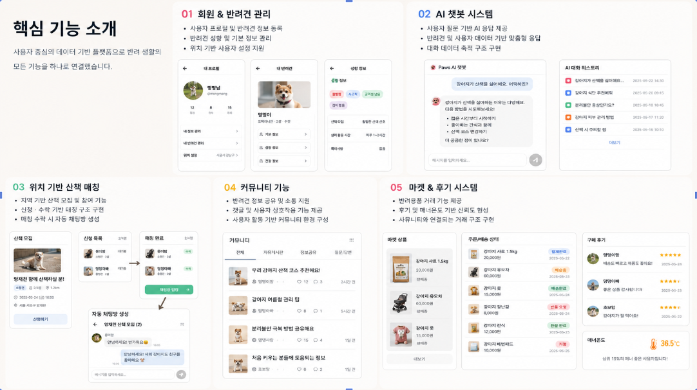
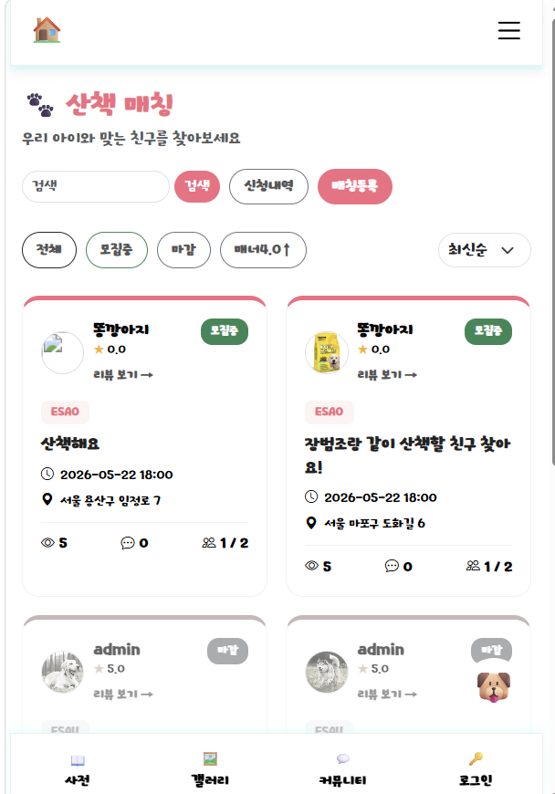
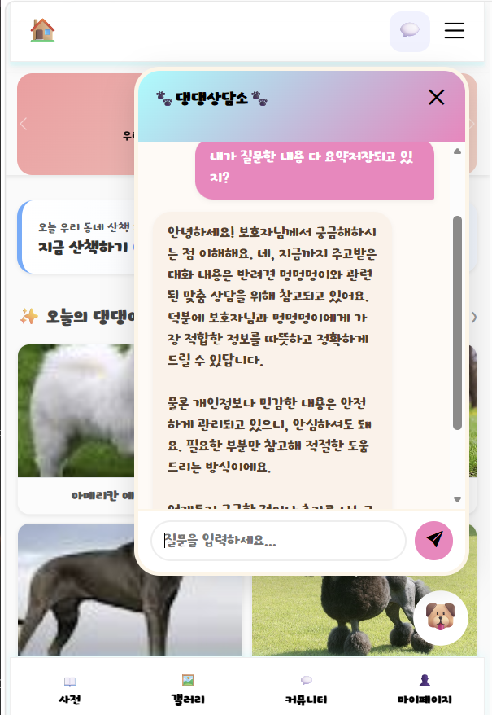
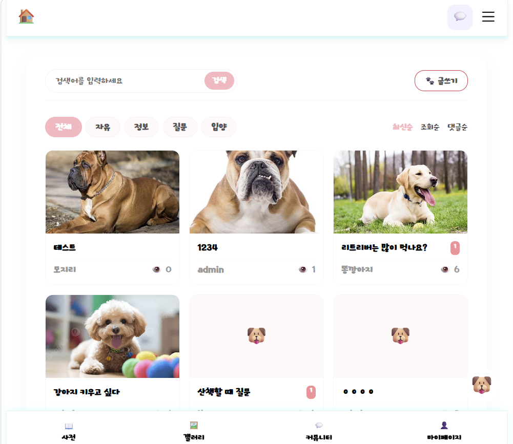
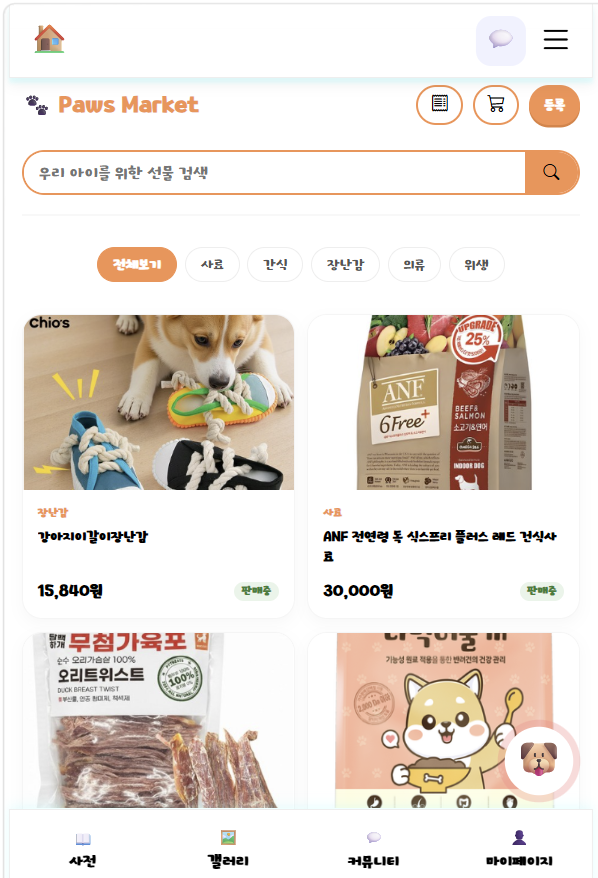
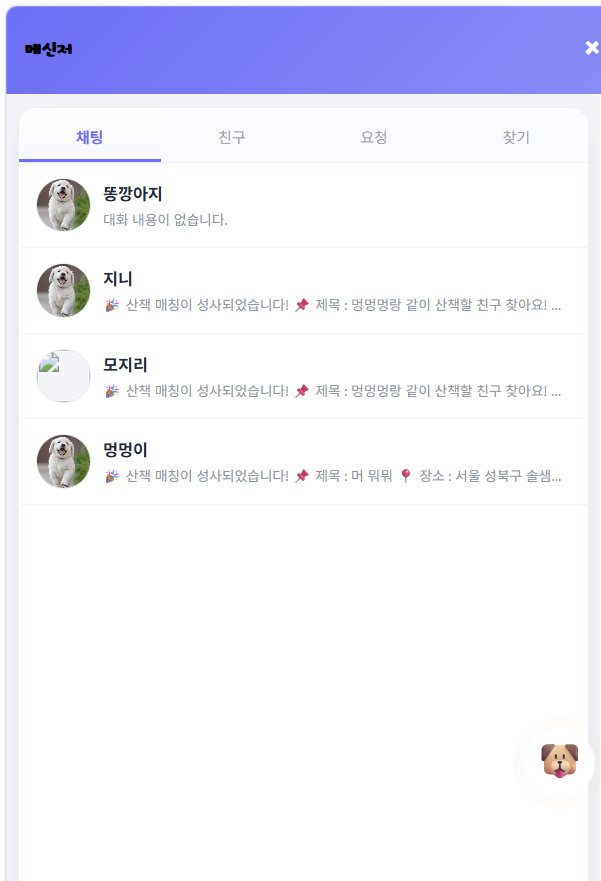

<!DOCTYPE html>
<html lang="ko">
<head>
  <meta charset="UTF-8" />
  <meta name="viewport" content="width=device-width, initial-scale=1.0"/>
  <title>PAWS | AI 기반 반려견 라이프 플랫폼</title>

  <!-- =========================
       🐾 Google Font
  ========================== -->
  <link rel="preconnect" href="https://fonts.googleapis.com">
  <link rel="preconnect" href="https://fonts.gstatic.com" crossorigin>

  <link href="https://fonts.googleapis.com/css2?family=Pretendard:wght@300;400;500;600;700;800&display=swap" rel="stylesheet">

  
</head>

<body>

<!-- =========================
     🌌 Background
========================== -->

<!-- =========================
     📌 Sidebar
========================== -->

<nav class="sidebar">
  <ul>
    <li><a href="#about">소개</a></li>
    <li><a href="#preview">서비스</a></li>
    <li><a href="#ai">AI</a></li>
    <li><a href="#features">기능</a></li>
    <li><a href="#stats">확장성</a></li>
    <li><a href="#developer">개발자</a></li>
  </ul>
</nav>

<!-- =========================
     🐾 Hero
========================== -->

<section class="hero">

  

    🐶 AI 기반 반려견 통합 플랫폼
  

  <h1>PAWS</h1>

  

    산책 매칭, AI 추천, 실시간 채팅, DBTI 분석,
    반려견 마켓과 커뮤니티를 하나로 연결한
    차세대 반려견 라이프 플랫폼
  

  

    <a href="#preview" class="btn btn-primary">
      서비스 보기
    </a>

    <a
      href="https://github.com/kookmin-sw/2026-capstone-61"
      target="_blank"
      class="btn btn-secondary"
    >
      GitHub
    </a>

  

</section>

<!-- =========================
     📌 About
========================== -->

<section id="about">

  

    PROJECT OVERVIEW

    <h2>
      반려인의 모든 경험을 
      하나로 연결하다
    </h2>

    

      PAWS는 단순 커뮤니티가 아닌,
      AI와 데이터를 기반으로 반려인의 일상,
      신뢰 기반 산책 매칭,
      맞춤 추천,
      거래,
      커뮤니티 경험을 통합한 스마트 플랫폼입니다.
    

  

</section>

<!-- =========================
     🖥️ Preview
========================== -->

<section id="preview">

  

    SERVICE PREVIEW

    <h2>
      실제 서비스 화면 기반 
      반응형 플랫폼 UI
    </h2>
  

  

    

      

      

        <h3>Smart Main</h3>

        

          AI 추천과 반려 라이프를
          하나의 메인 화면으로 통합한
          스마트 대시보드 UI
        

      

    

    

      

      

        <h3>Walking Match</h3>

        

          위치 기반 산책 매칭과
          매너온도 기반 신뢰 시스템
        

      

    

    

      

      

        <h3>AI Chatbot</h3>

        

          GPT 기반 장기 메모리 구조와
          사용자 행동 분석 기반 추천
        

      

    

    

      

      

        <h3>Community</h3>

        

          자유게시판과 정보 공유,
          실시간 사용자 커뮤니티
        

      

    

    

      

      

        <h3>PAWS Market</h3>

        

          리뷰 기반 신뢰도와
          반려견 상품 거래 시스템
        

      

    

    

      

      

        <h3>Realtime Chat</h3>

        

          매칭 이후 자동 생성되는
          실시간 채팅 시스템
        

      

    

  

</section>

<!-- =========================
     🤖 AI
========================== -->

<section id="ai">

  

    AI SYSTEM

    <h2>
      사용자 데이터가 쌓일수록 
      더 똑똑해지는 AI
    </h2>
  

  

    

      

        <h3>📥 Input Data</h3>

        

          사용자 질문,
          DBTI,
          채팅 기록,
          리뷰,
          활동 로그 데이터를 수집
        

      

      

        <h3>🧠 AI Processing</h3>

        

          OpenAI GPT 기반 분석,
          사용자 성향 학습,
          추천 점수 계산
        

      

      

        <h3>🚀 Personalized Result</h3>

        

          맞춤 산책 추천,
          AI 챗봇 응답,
          사용자 맞춤 콘텐츠 제공
        

      

    

    

      
    

  

</section>

<!-- =========================
     📊 Stats
========================== -->

<section id="stats">

  

    SCALABILITY

    <h2>
      데이터 중심 플랫폼으로 
      지속적인 확장 가능
    </h2>
  

  

    

      <h3>AI</h3>
      
개인화 추천 시스템

    

    

      <h3>DBTI</h3>
      
반려견 성향 분석

    

    

      <h3>GPS</h3>
      
위치 기반 산책 매칭

    

    

      <h3>CHAT</h3>
      
실시간 메신저 구조

    

  

</section>

<!-- =========================
     👨‍💻 Developer
========================== -->

<section id="developer" class="developer">

  

    SOLO DEVELOPMENT

    <h2>
      기획부터 배포까지 
      1인 개발 프로젝트
    </h2>
  

  

    <h3>장범조</h3>

    

      기획 · UI/UX · 프론트엔드 · 백엔드 ·
      데이터베이스 설계 · AI 기능 구현 · 서버 배포
      전 과정을 직접 개발했습니다.
    

  

</section>

<!-- =========================
     🚀 Footer
========================== -->

<footer>

  

    © 2026 PAWS — AI 기반 반려견 라이프 플랫폼
  

</footer>

</body>
</html>
